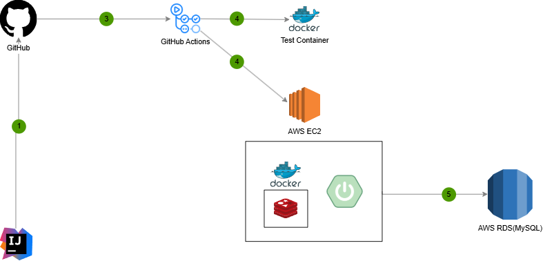

# 🛒 **E-Commerce Backend**

---

## 📖 **목차**
1. [프로젝트 개요](#프로젝트-개요)
2. [주요 기능](#주요-기능)
3. [아키텍처](#아키텍처)
4. [기술 스택](#기술-스택)
5. [시작하기](#시작하기)
6. [API 문서](#api-문서)
7. [문의](#문의)

---

## 📌 **프로젝트 개요**

---

## ✨ **주요 기능**
- **잔액 충전/조회 API**
  - 멱등성을 고려한 잔액 충전 (with.Redis)
- **주문 / 결제 API**
  - 이벤트 기반 사용자 주문처리
  - Race Condition을 예방한 재고 차감 동시성 처리
  - 포인트 차감
- **캐싱**
  - 인기 상품 등 자주 조회되는 결과를 캐싱하여 응답속도 개선
- **모니터링**
  - Prometheus와 Grafana를 활용한 시스템 지표 시각화.

---

## ⚙️ **Architecture**

### **시스템 설계**

### 1. [마일스톤](https://github.com/JGwanghou/hhplus-ecommerce/blob/main/docs/01_Milestone.md)

### 2. [시퀀스다이어그램](https://github.com/JGwanghou/hhplus-ecommerce/blob/main/docs/02_SequenceDiagram.md)

### 3. [ERD](https://github.com/JGwanghou/hhplus-ecommerce/blob/main/docs/03_ERD.md)
    
### 4. [API 명세서](https://github.com/JGwanghou/hhplus-ecommerce/blob/main/docs/04_API.md)

### 5. [Swagger](https://github.com/JGwanghou/hhplus-ecommerce/blob/main/docs/05_Swagger.md)

### 6. [동시성 보고서](https://github.com/JGwanghou/hhplus-ecommerce/blob/main/docs/06_Concurrently.md)

### 7. [Index 개선 시도](https://kh-well.tistory.com/76)

---