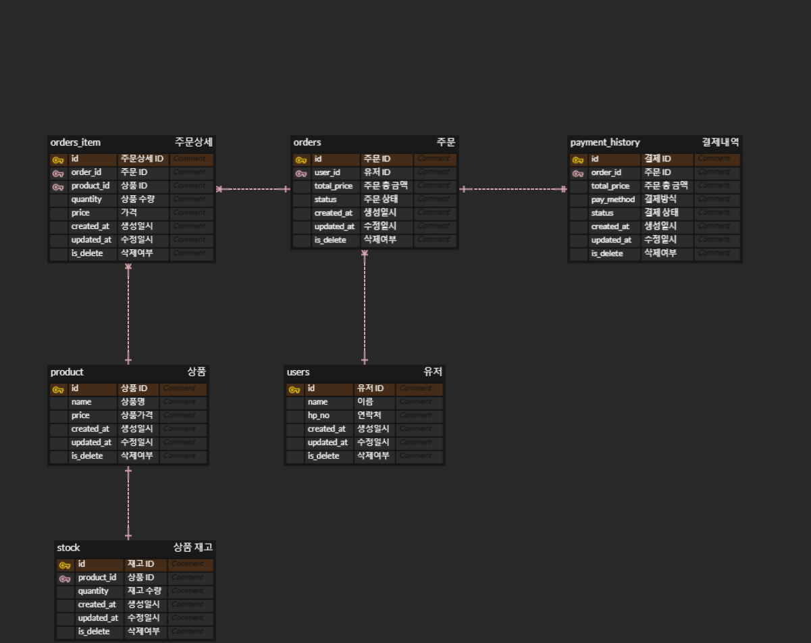
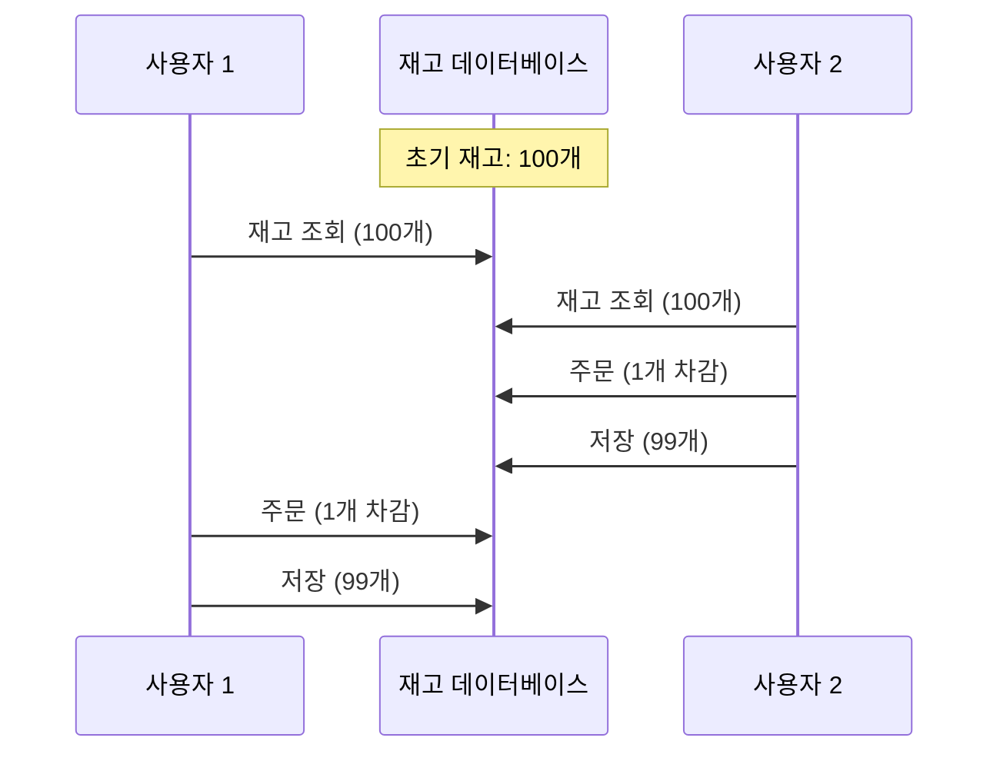
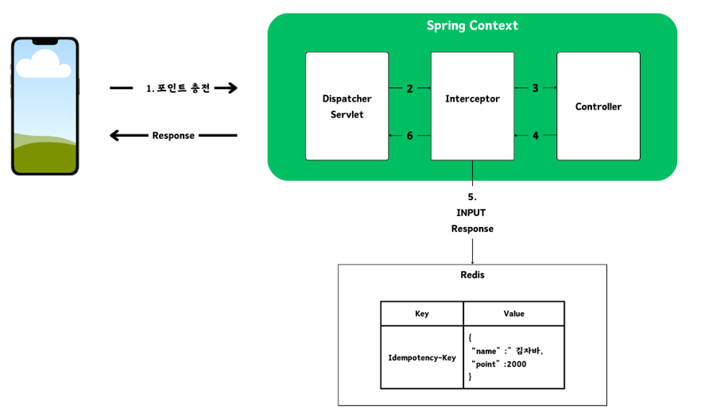

# 🛒 **E-Commerce Backend**


## 📌 **주요 기능**

- **잔액 충전/조회 API**
  - `멱등성`을 고려한 잔액 충전 (with.Redis)
- **주문 / 결제 API**
  - `이벤트 기반` 사용자 주문처리
  - Race Condition을 예방한 재고 차감 동시성 처리
  - 포인트 차감
- **캐싱**
  - 인기 상품 등 자주 조회되는 결과를 캐싱하여 응답속도 개선
- **모니터링**
  - Prometheus와 Grafana를 활용한 시스템 지표 시각화.


## 📝 설계 문서
<details>
  <summary>마일스톤</summary>

## [3주차] 프로젝트 설계
|     | 작업 | 예상 시간 (시간) |
  |-----|------|----------------|
| 1   | **프로젝트 설계** | **40** |
| 1.1 | 주차 별 마일스톤 설정 | 2 |
| 1.2 | 요구사항 분석 | 8 |
| 1.3 | 시퀀스 다이어그램 작성 | 8 |
| 1.4 | ERD 설계 | 8 |
| 1.5 | API 명세서 작성 | 8 |
| 1.6 | Mock API 구현 | 8 |

## [4주차] 프로젝트 API 구현(With TDD)

|  | 작업                   | 예상 시간 (시간) |
  |--|----------------------|------------|
| 2 | **TDD로 프로젝트 API 구현** | **40**     |
| 2.1 | [주요] 잔액 충전 / 조회 API  | -          |
| 2.1.1 | 잔액 충전 API 개발         | 2          |
| 2.1.2 | 잔액 조회 API 개발         | 2          |
| 2.2 | [기본] 상품 조회 API       | -          |
| 2.2.1 | 상품 정보조회 API 개발       | 8          |
| 2.3 | [주요] 주문 / 결제 API     | -          |
| 2.3.1 | 주문 API 및 포인트 결제 개발   | 16         |
| 2.4 | [기본] 상품 조회 API       | -          |
| 2.4.1 | 판매량 최다 상품 조회         | 3          |

## [5주차] 고도화 및 코드 리팩토링

|    | 작업 | 예상 시간 (시간) |
  |----|------|------------|
| 3  | **고도화 및 코드 리팩토링** | **40**     |
| 3.1 | 고도화 | 20          |
| 3.2 | 동시성 이슈 검토 | 12         |
| 3.3 | 코드 리팩토링 | 8          |
</details>

<details>
  <summary>ERD</summary>


</details>

<details>
  <summary>시퀀스 다이어그램</summary>

### 잔액 조회
  ```mermaid
  sequenceDiagram
  autonumber

  actor Client
  participant UserService
  participant UserDB
  Client->>UserService: GET /api/v1/users/{userId}
  UserService->>UserDB: 사용자 조회

  opt 유저 존재하지 않는 경우
    UserDB-->>UserService: UserNotFoundException
    UserService-->>Client: 404 NOT FOUND
  end
UserDB-->>UserService: 
    UserService-->>Client: 유저정보 반환
  ```

### 상품 조회
  ```mermaid
  sequenceDiagram
  autonumber

  actor Client
  participant ProductFacade
  participant ProductService
  participant StockService
  Client->>ProductFacade: GET /api/v1/users/{userId}


```

### 잔액 충전
  ```mermaid
  sequenceDiagram
  autonumber
  actor Client
  participant UserService
  participant UserDB
  Client->>UserService: POST /api/v1/users/{userId}/charge
  UserService->>UserDB: 사용자 조회

  opt 유저 존재하지 않는 경우
    UserDB-->>UserService: UserNotFoundException
    UserService-->>Client: 404 NOT FOUND
  end
  opt 충전금액: 0원 이하, 0원, 1,000,000원 이상
    UserDB-->>UserService: InvalidChargeAmountException
    UserService-->>Client: 400 BAD REQUEST
  end
UserDB-->>UserService: 
    UserService-->>Client: 유저정보 반환(충전 후 잔액) 
  ```

### 주문 동작흐름
  ```mermaid
  sequenceDiagram
  autonumber
  actor Client
  participant OrderAPI
  participant StockService
  participant UserService
  participant PaymentService
  participant Redisson
  participant DB
  participant MessageQueue
  participant NotificationService
  Client->>OrderAPI: POST /api/orders
  Note over OrderAPI: 트랜잭션 시작
  OrderAPI->>DB: 주문 정보 저장(status = '대기')
  OrderAPI->>DB: 주문 상세정보 저장
  Note over StockService: 트랜잭션 시작
  loop
    StockService->>Redisson: 상품번호 기준 락 흭득
    StockService->>DB: 재고 조회
    alt 재고개수 = 0
      DB-->>StockService: 409 CONFLICT
      StockService-->>Client: 409 CONFLICT
    else 재고개수 > 0
      Redisson->>DB: 재고차감
    end
  end
  Note over StockService: 트랜잭션 종료
  UserService->>PaymentService: 보유 포인트 조회
  alt 보유포인트 < 주문금액
    PaymentService-->>Client: 포인트부족 예외
  else 보유포인트 >= 주문금액
    UserService->>PaymentService: 보유 포인트 차감
    PaymentService-->>DB: 차감 내역 저장
  end
  Note over OrderAPI: 트랜잭션 종료
  OrderAPI-->>Client: order ID : 12345
  Note over OrderAPI,NotificationService: 외부에 데이터 전송
  OrderAPI->>MessageQueue: 주문내역 전송
  MessageQueue-->>NotificationService: 주문내역
  par Notification Channels
    NotificationService->>NotificationService: 알림톡 전송
  end
  ```

</details>

<details>
  <summary>API 명세서</summary>

# 이커머스 주문 시스템 API 명세서

---

# GET /api/v1/users/{userId} - 잔액 조회요청

- Description
> 유저 한 명이 자신의 포인트 조회를 한다.

- PathVariable
  - userId: 유저 Id

### Response

```json
[
  {
    "userId": 25,
    "name": "김테스트",
    "hpNo": "010-1234-4112",
    "amount": "100,000"
  }
]
```

### Error

| code | message        | etc |
|------|----------------|-----|
| 404  | 존재하지 않는 유저입니다. |     |     

---
# POST /api/v1/users/{userId}/charge - 잔액 충전요청

- Description
> 유저 한 명이 포인트 충전을 한다.

- Header
  - Idempotency-Key: 멱등성 키
- PathVariable
  - userId: 유저 Id
- UserPointChargeRequest
  - chargeAmount: 충전 요청 금액
### RequestBody
```json
[
  {
    "chargeAmount" : 50000
  }
]
```

### Response

```json
[
  {
    "userId": 25,
    "name": "김테스트",
    "hpNo": "010-1234-4112",
    "amount": "150,000"
  }
]
```

### Error

| code | message                   | etc    |
|------|---------------------------|--------|
| 400  | 최소 충전 금액은 1,000원 입니다.     |  |
| 400  | 최대 충전 금액은 1,000,000원 입니다. |  |
| 400  | 멱등성 키가 누락되었습니다.           |  |
| 404  | 존재하지 않는 유저입니다.            |  |
| 409  | 이미 처리중인 요청입니다.            |  |

---

---
# GET /products/{productId} - 상품 상세조회 요청

- Description
> 상품 목록 중 하나의 상품를 조회한다.

- PathVariable
  - productId: 상품 Id

### Response

```json
[
  {
    "id": 25,
    "name": "빽다방 아메리카노",
    "price": 2500,
    "stock": 9
  }
]
```

### Error

| code | message       | etc    |
|------|---------------|--------|
| 400  | 잘못된 상품 번호입니다. |  |     

---

---
# POST /api/v1/orders - 주문/결제

- Description
> 한 명의 사용자가 여러 개 또는 하나의 상품을 주문한다.

- PathVariable
  - userId: 유저 Id
### RequestBody
```json
[
  {
    "id": 1,
    "user_id": 25,
    "products": [
      {
        "id": 101,
        "name": "양배추 샐러드",
        "quantity": 2
      },
      {
        "id": 102,
        "name": "단호박 샐러드",
        "quantity": 2
      },
      {
        "id": 103,
        "name": "버섯 샐러드",
        "quantity": 1
      }
    ],
    "paymentAmount": 10000
  }
]
```

### Response

```json
[
  {
    "orderId": "1"
  }
]
```

### Error

| code | message           | etc            |
|------|-------------------|----------------|
| 404  | 해당 상품이 존재하지 않습니다. |  |
| 404  | 해당 유저가 존재하지 않습니다. |  |  
| 409  | 결제 금액이 부족합니다.     |  |
| 409  | 품절된 상품이 존재합니다.    |  |

---

---
# GET /products/popular - 인기상품 조회

- Description
> 최근 3일간 최다 판매량 상품 5개를 조회한다.

### Response

```json
[
  {
    "id": 101,
    "name": "양배추 샐러드",
    "sale_count": 20
  },
  {
    "id": 102,
    "name": "단호박 샐러드",
    "sale_count": 18
  },
  {
    "id": 103,
    "name": "버섯 샐러드",
    "sale_count": 10
  },
  {
    "id": 104,
    "name": "감자 샐러드",
    "sale_count": 8
  },
  {
    "id": 105,
    "name": "오이 샐러드",
    "sale_count": 6
  }
]
```

---
</details>

## 🚀 기술 스택
- **Backend: Spring Boot, JPA, JUnit, MySQL, Redisson(Redis)**
- **CI/CD: Github actions, Docker**

## ⚙️ **Architecture**


## ✅ 문제 해결 및 학습내용
<details>
  <summary>1️⃣ 동시성 이슈</summary>

## 재고 감소 문제에 따른 분석

### 재고 감소 비즈니스 로직
```java
@Transactional
public void decreaseStock(List<OrderProductsRequest> req) {
    for (OrderProductsRequest orderRequest : req) {
        // 락 사용하지 않은 일반적인 상품정보 읽기
        ProductStockEntity productStock = productStockRepository.findById(orderRequest.getProduct_id());
        productStock.decreaseStock(orderRequest.getProduct_id(), (long) orderRequest.getProduct_quantity());
    }
}
```

### 동시성 테스트코드
```java
/*
    재고 갯수가 100개인 상품에 100번의 주문을 시도합니다.
 */
int threadCount = 100;
ExecutorService executorService = Executors.newFixedThreadPool(32);
CountDownLatch latch = new CountDownLatch(threadCount);

for(int i=0; i<threadCount; i++){
    executorService.submit(() -> {
        try {
        productService.decreaseStock(req);
        } finally {
            latch.countDown();
        }
    });
}

latch.await();

assertEquals(0, product.getStock());
```
해당 메서드를 병렬적으로 100번 수행 후 0개가 남길 기대하지만, 테스트에 실패하게 됩니다.

### 왜 실패하는가?


- 다른 사용자와 `동시에 같은 개수`로 읽게 되었을 때, <b>사용자2</b>가 주문했음에도 불구하고 <b>사용자1</b>은 아무런 영향을 받지않고 있습니다. 이처럼, <b>두 개 이상의 쓰레드가 공유데이터에 접근하여 동시에 변경</b>하려는 문제를 <b>레이스 컨디션(Race Condition)</b> 문제라고 합니다.
- 분석 결과, 현재 사용자 두 명 이상이 A라는 상품을 주문하게 될 시 레이스 컨디션 문제가 발생합니다.

### 어떻게 해결할 것인가?
우리는 <b>공유자원</b>에 접근한다는 기준, `사용자 2`가 주문할 시 `사용자 1`쓰레드에도 재고수량 동기화가 필요합니다.

### 동기화 방법

### 1. synchronized

전통적인 동기화 방식입니다. 메서드나 메서드 내 임계구역을 설정하여 <b>하나의 쓰레드만 접근 가능</b>하며, 해당 쓰레드만이 임계구역 해제하여 동기화를 보장합니다. 하지만, 한 개의 프로세스 안에서만 보장되며 서버가 여러 대일 때는 데이터에 여러 대의 프로세스가 접근 가능하여 레이스 컨디션 문제가 발생합니다.

### 2. DB Lock

synchronized은 애플리케이션 코드에서 임계구역을 설정했다면, 해당 방법은 우리의 외부DB에 임계구역을 설정하여 여러 대의 서버 상황에서도 동기화를 보장할 수 있습니다.
낙관적 락/비관적 락이 존재하며, 다음과 같은 특징이 있습니다.

- 낙관적 락:
  DB에 Lock을 걸지 않고 읽기 시점/쓰기 시점의 데이터 변경 여부에 따라
  동시성을 제어하는 방식이라 성능이 비관적 락보다 상대적으로 높습니다.
  트랜잭션 간 충돌이 많아질 경우 retry 빈도 증가하게 되며 DB Connection, 스레드 점유 등의 단점이 존재합니다.


- 비관적 락:
  테이블 또는 행에 Lock을 설정(x-lock) 하나의 트랜잭션만 작업이 가능하여 일관성을 확보하지만 해당 작업이 끝날때 까지 다른 트랜잭션은 대기 상태입니다.
  트래픽이 몰리는 경우 락 대기시간으로 latency가 증가할 수 있습니다.

### 3. 분산 락
DB Lock은 데이터 정합성 보장에 효과적이지만, 높은 동시성이 요구되는 경우(대규모) 병목 현상으로 성능이 저하될 수 있습니다. 이에 `중대규모 프로젝트시 분산락`을 고려할 수도 있습니다. 빠른 성능을 위해 Redis 를 사용했으며, 자바에서 사용할 수 있는 클라이언트는 크게 Jedis, Lettuce, Redisson 3가지 입니다.
#### Lettuce
- Netty 기반의 Redis Client로 넌블로킹 I/O로 구현되어 비동기 방식으로 처리, 고성능
- SETNX를 이용하여 Spin Lock 형태를 구현
- 경쟁 스레드들이 지속적으로 요청을 보내기 때문에 서버 부하가 심하다
- 개발자가 직접 retry, timeout 구현해야하며 지속적인 재시도로 네트워크 비용과 스레드 점유등의 문제가 발생

#### Redisson
- 네트워크 트래픽 또는 CPU 사용량을 줄이기 위해 Lua 스크립트를 활용합니다.
- 재시도 로직을 내장하고 있어 락 흭득을 위한 별도의 재시도 로직을 작성하지 않아도 됩니다.
- 동시에 락 흭득 요청 시 FIFO 형태로 요청 순서를 보장합니다.

## 재고 감소 문제해결 및 성능비교

DB Lock과 분산 락을 이용하여 문제 해결을 진행하겠습니다
- 상품 `PRODUCT` 테이블
- 상품재고 `PRODUCT_STOCK` 테이블
- 테스트 조건: 재고 100개인 상품에 100번 동시 차감시도

### DB Lock(비관적 락 설정)

```java
// 상품재고 테이블 락
@Lock(LockModeType.PESSIMISTIC_WRITE)
ProductStockEntity findByProductIdWithPessimisticLock(@Param("productId") Long productId);
```
### 실행결과 : 테스트 통과, 실행시간 348ms


### 분산 락(Redis-Lettuce)
```java
// 구현코드
public class OrderUseCase {
    // ..
    
    public Long order(OrderRequest request) {
        for (OrderProductsRequest prod : request.getProducts()) {
            
            while(!redisLockRepository.lock(prod.getProduct_id())){
                try{
                    Thread.sleep(500);
                }catch (InterruptedException e){
                    throw new RuntimeException(e);
                }
            }

            try{
                productService.decreaseStock(prod.getProduct_id(), (long) prod.getProduct_quantity());
            }finally {
                redisLockRepository.unlock(prod.getProduct_id());
            }
        }
        
        // ...
    }
}
```
### 실행결과 : 테스트 통과, 실행시간 17660ms


### 분산 락(Redis-Redisson)
```java
@Configuration
public class RedissonConfig {
    // redisHost..
  
    @Bean
    public RedissonClient redissonClient() {
        RedissonClient redisson = null;
        Config config = new Config();
        config.useSingleServer().setAddress(REDISSON_HOST_PREFIX + redisHost + ":" + redisPort);
        redisson = Redisson.create(config);
        return redisson;
    }
}

public class OrderUseCase {
    // ..
    
    public Long order(OrderRequest request) {
        for (OrderProductsRequest prod : request.getProducts()) {
            RLock rLock = redissonClient.getLock(String.format("LOCK:PROD-%d", prod.getProduct_id()));

            try {
                boolean available = rLock.tryLock(10, 1, TimeUnit.SECONDS);
                if(!available) {
                    throw new IllegalArgumentException("Lock Not acquired");
                }
                productService.decreaseStock(prod.getProduct_id(), (long) prod.getProduct_quantity());
            } catch (InterruptedException e) {
                throw new RuntimeException(e);
            } finally {
                rLock.unlock();
            }
        }
        
        // ...
    }
}
```
### 실행결과 : 테스트 통과, 실행시간 673ms


### 결과
비관적 락, Lettuce 락, Redisson 락을 사용하여 상품 재고에 대한 정합성을 확보했습니다.
또한, 방식에 따라 성능지표를 확인하며 락 특징들에 대한 이해를 쌓았습니다.

### 💹 (추가) 분산 락 특징 및 유의할 점
## 🌟 Best practice
- 분산 락 구현시 트랜잭션은 데이터의 무결성을 보장하기 위해 `"락 흭득을 우선"`
  
  <br/>
- `@Transactional`이 존재하는 decreaseStock 메서드 경우 메서드 시작 전에 프록시 객체가 생성되어 tx.begin()을 시작해버리기 때문에 외부에서 락을 잡아놓고 진행되어야합니다.
- 해당 사항을 고려하여 OrderUsecase에서 먼저 상품 번호에 대한 Lock 흭득 후 decreasStock 메서드가 수행되도록 진행 했습니다.
- 이를 위반한 경우 아래 예제에 내용을 포함했습니다.
## ☔ Bad practice

### <b>1. 트랜잭션이 먼저 시작되고 락을 획득 하는경우</b>

- 락을 먼저 흭득하지 않고 tx.begin()를 하게 되는 경우 A라는 상품에 대해 사용자1, 사용자2가 동시에 읽어버리게 됩니다.
- 읽은 데이터로, 값을 수정하기 때문에 `분실 갱신(Lost Update)`이 발생하며 사용자1 또는 사용자2의 행동이 무효화됩니다.
- 해결할 수 있는 방법은 commit시 version 확인을 통해 값을 비교할 수 있는 낙관적 락으로 생각됩니다.

### <b>2. 트랜잭션 커밋 전 락이 해제되는 경우</b>

- 실무에서 가장 많이 발생하는 실수라고 들었던 것 같습니다.
- 핵심 포인트는 `수정 사항을 커밋 이후 락 해제!`
</details>

<details>
  <summary>2️⃣ 멱등성</summary>
  <div> > 첫 번째 수행을 한 뒤 여러 차례 적용해도 결과를 변경시키지 않는 작업 또는 기능의 속성</div>

포인트 충전 시 더블클릭/네트워크 오류로 인한 중복된 리소스가 생성되지 않도록 했습니다.(공짜돈 방지)

# 1. 구현
## 1-1. 인터셉터
```text
기능 개발에 앞서 어느 계층에 적용하는 것이 적합한 것인가에 대해 고민했습니다.

1. 서비스
2. 컨트롤러
3. 인터셉터
```
인터셉터로 선정했습니다.
- 동일한 요청에 대해 `컨트롤러와 도메인 로직이 실행 되는 것이 적합하지 않다고 판단`하였습니다.
- 또한, `예외처리의 이유로 스프링 컨테이너로 관리되는 인터셉터에서 진행`했습니다.

### 1-2. 로직 과정

[코드 자세히 보기](https://github.com/JGwanghou/ho-commerce/blob/b9bb3043a75060c732ecabd0904cac72920edb79/src/main/java/com/gwangho/commerce/app/api/interceptor/IdempotencyInterceptor.java)
1. 최초 요청을 합니다.</br>
   1.1. DB에 결과를 반영합니다.</br>
   1.2. 인터셉터에서 Response를 레디스에 저장합니다.</br>
   1.3. 필터에서 복사 된 Response를 클라이언트에게 반환합니다.</br>

2. 순간 동일 요청 시 처리중(409)에러 반환
3. 동일 요청 시 도메인 로직을 거치지 않고 레디스 캐싱 값으로 응답

기존에는 요청(preHandle)시 멱등성 키를 redis-key로 설정 후 컨트롤러를 진행하도록 했습니다.
하지만, 잘못된 인자값 또는 처리 중 오류가 발생한 경우에도 레디스에 키가 저장됐습니다.</br>

해당 문제를 발견하고 성공적으로 응답이 반환 된 경우만 레디스에 저장하기로 결정했습니다.
</details>

<details>
<summary>3️⃣ 테스트 격리</summary>
<div>
