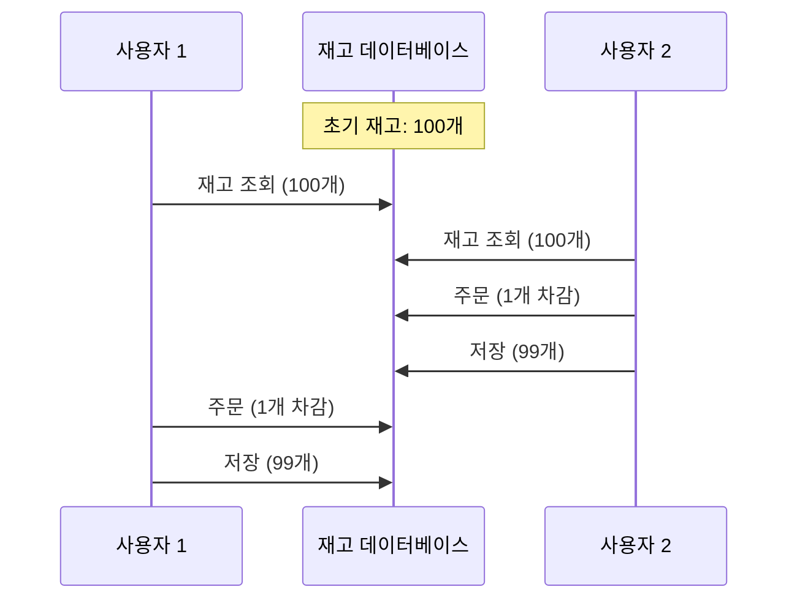
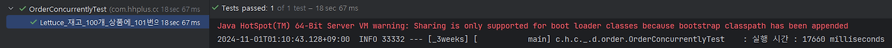
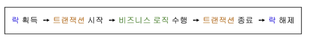
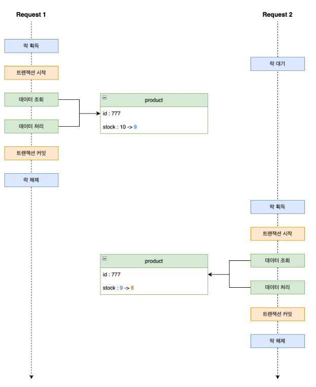
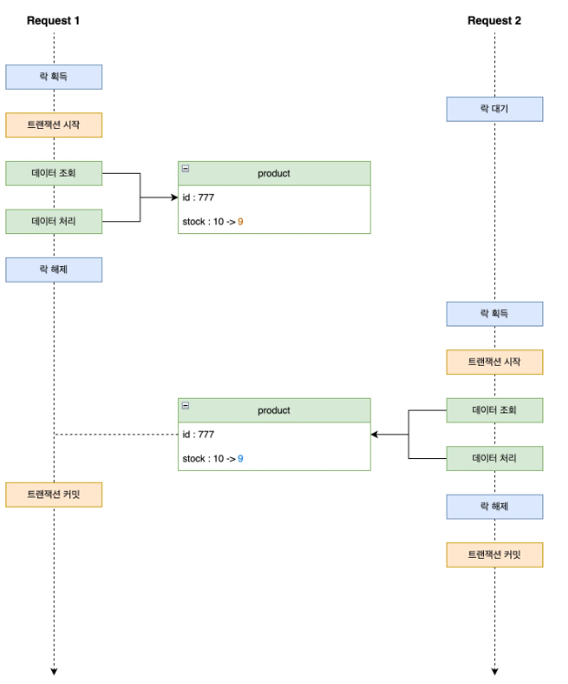
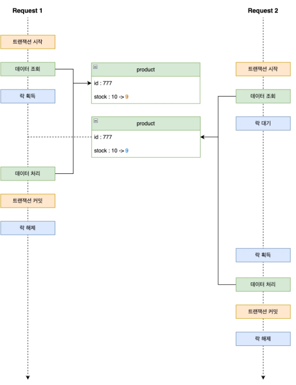

## 재고 감소 문제에 따른 분석

### 재고 감소 비즈니스 로직
```java
@Transactional
public void decreaseStock(List<OrderProductsRequest> req) {
    for (OrderProductsRequest orderRequest : req) {
        // 락 사용하지 않은 일반적인 상품정보 읽기
        ProductStockEntity productStock = productStockRepository.findById(orderRequest.getProduct_id());
        productStock.decreaseStock(orderRequest.getProduct_id(), (long) orderRequest.getProduct_quantity());
    
        productStockRepository.stockSave(productStock);
    }
}
```

### (실패) 재고차감 동시성 테스트

```java
/*
    재고 갯수가 100개인 상품에 100번의 주문을 시도합니다.
 */
int threadCount = 100;
ExecutorService executorService = Executors.newFixedThreadPool(32);
CountDownLatch latch = new CountDownLatch(threadCount);

for(int i=0; i<threadCount; i++){
    executorService.submit(() -> {
        try {
        productService.decreaseStock(req);
        } finally {
            latch.countDown();
        }
    });
}

latch.await();

assertEquals(0, product.getStock());
```

- 해당 테스트 진행 시, 재고 개수는 0이길 기대하지만 실패합니다.
### 왜 실패하는가?


 - 다른 사용자와 `동시에 같은 개수`로 읽게 되었을 때, <b>사용자2</b>가 주문했음에도 불구하고 <b>사용자1</b>은 아무런 영향을 받지않고 있습니다. 이처럼, <b>두 개 이상의 쓰레드가 공유데이터에 접근하여 동시에 변경</b>하려는 문제를 <b>레이스 컨디션(Race Condition)</b> 문제라고 합니다.
 - 분석 결과, 현재 사용자 두 명 이상이 A라는 상품을 주문하게 될 시 레이스 컨디션 문제가 발생합니다.

### 어떻게 해결할 것인가?
우리는 <b>공유자원</b>에 접근한다는 기준, `사용자 2`가 주문할 시 `사용자 1`쓰레드에도 재고수량 동기화가 필요합니다.

### 동기화 방법

### 1. synchronized

전통적인 동기화 방식입니다. 메서드나 메서드 내 임계구역을 설정하여 <b>하나의 쓰레드만 접근 가능</b>하며, 해당 쓰레드만이 임계구역 해제하여 동기화를 보장합니다. 하지만, 한 개의 프로세스 안에서만 보장되며 서버가 여러 대일 때는 데이터에 여러 대의 프로세스가 접근 가능하여 레이스 컨디션 문제가 발생합니다.

### 2. DB Lock

synchronized은 애플리케이션 코드에서 임계구역을 설정했다면, 해당 방법은 우리의 외부DB에 임계구역을 설정하여 여러 대의 서버 상황에서도 동기화를 보장할 수 있습니다.
낙관적 락/비관적 락이 존재하며, 다음과 같은 특징이 있습니다.

- 낙관적 락:
  DB에 Lock을 걸지 않고 읽기 시점/쓰기 시점의 데이터 변경 여부에 따라
  동시성을 제어하는 방식이라 성능이 비관적 락보다 상대적으로 높습니다.
  트랜잭션 간 충돌이 많아질 경우 retry 빈도 증가하게 되며 DB Connection, 스레드 점유 등의 단점이 존재합니다.


- 비관적 락:
  테이블 또는 행에 Lock을 설정(x-lock) 하나의 트랜잭션만 작업이 가능하여 일관성을 확보하지만 해당 작업이 끝날때 까지 다른 트랜잭션은 대기 상태입니다.
  트래픽이 몰리는 경우 락 대기시간으로 latency가 증가할 수 있습니다.

### 3. 분산 락

DB Lock은 데이터 정합성 보장에 효과적이지만, 높은 동시성이 요구되는 경우(대규모) 병목 현상으로 성능이 저하될 수 있습니다. 이에 `중대규모 프로젝트시 분산락`을 고려할 수도 있습니다. 빠른 성능을 위해 Redis 를 사용했으며, 자바에서 사용할 수 있는 클라이언트는 크게 Jedis, Lettuce, Redisson 3가지 입니다.
#### Lettuce
- Netty 기반의 Redis Client로 넌블로킹 I/O로 구현되어 비동기 방식으로 처리, 고성능
- SETNX를 이용하여 Spin Lock 형태를 구현
- 경쟁 스레드들이 지속적으로 요청을 보내기 때문에 서버 부하가 심하다
- 개발자가 직접 retry, timeout 구현해야하며 지속적인 재시도로 네트워크 비용과 스레드 점유등의 문제가 발생

#### Redisson
- 네트워크 트래픽 또는 CPU 사용량을 줄이기 위해 Lua 스크립트를 활용합니다.
- 재시도 로직을 내장하고 있어 락 흭득을 위한 별도의 재시도 로직을 작성하지 않아도 됩니다.
- 동시에 락 흭득 요청 시 FIFO 형태로 요청 순서를 보장합니다.

## 재고 감소 문제해결

DB Lock과 분산 락을 이용하여 문제를 해결해보겠습니다.
현재 PRODUCT 테이블과 PRODUCT_STOCK 테이블이 분리되어 있는 상황입니다.

### DB Lock(비관적 락)

레이스 컨디션으로 인한 충돌 빈도가 잦을 수 있다 판단하여 낙관적 락은 생략했습니다.
기존 findById과 달리 @Lock 어노테이션으로 락을 설정하여 

```java
@Lock(LockModeType.PESSIMISTIC_WRITE)
ProductStockEntity findByProductIdWithPessimisticLock(@Param("productId") Long productId);
```


### 분산 락(Redis-Lettuce)
```java
@RequiredArgsConstructor
@Component
public class RedisLockRepository {
    private final RedisTemplate<String, String> redisTemplate;

    public Boolean lock(Object key) {
        return redisTemplate
                .opsForValue()
                .setIfAbsent(key.toString(), "lock", Duration.ofMillis(3000));
    }

    public Boolean unlock(Object key) {
        return redisTemplate.delete(key.toString());
    }
}

public class OrderUseCase {
    // ..
    
    public Long orderWithLettuce(OrderRequest request) {
        for (OrderProductsRequest prod : request.getProducts()) {
            
            while(!redisLockRepository.lock(prod.getProduct_id())){
                try{
                    Thread.sleep(500);
                }catch (InterruptedException e){
                    throw new RuntimeException(e);
                }
            }

            try{
                productService.LettuceDecreaseStock(prod.getProduct_id(), (long) prod.getProduct_quantity());
            }finally {
                redisLockRepository.unlock(prod.getProduct_id());
            }
        }
        
        // ...
    }
}
```


### 분산 락(Redis-Redisson)
```java
@Configuration
public class RedissonConfig {
    @Value("${spring.data.redis.host}")
    private String redisHost;

    @Value("${spring.data.redis.port}")
    private int redisPort;

    private static final String REDISSON_HOST_PREFIX = "redis://";

    @Bean
    public RedissonClient redissonClient() {
        RedissonClient redisson = null;
        Config config = new Config();
        config.useSingleServer().setAddress(REDISSON_HOST_PREFIX + redisHost + ":" + redisPort);
        redisson = Redisson.create(config);
        return redisson;
    }
}

public class OrderUseCase {
    // ..
    
    public Long orderWithRedisson(OrderRequest request) {
        for (OrderProductsRequest prod : request.getProducts()) {
            RLock rLock = redissonClient.getLock(String.format("LOCK:PROD-%d", prod.getProduct_id()));

            try {
                boolean available = rLock.tryLock(10, 1, TimeUnit.SECONDS);
                if(!available) {
                    throw new IllegalArgumentException("Lock Not acquired");
                }
                productService.RedissonDecreaseStock(prod.getProduct_id(), (long) prod.getProduct_quantity());
            } catch (InterruptedException e) {
                throw new RuntimeException(e);
            } finally {
                rLock.unlock();
            }
        }
        
        // ...
    }
}
```


### 분산 락 특징 및 유의할 점
DB락 코드와 분산 락 코드의 다른점이 보이시나요?<br/>
분산 락 구현시 트랜잭션은 데이터의 무결성을 보장하기 위해 락 흭득을 우선시 해야합니다.


<br/>

아래는 정상 케이스가 아닌 경우입니다.<br/>
### <b>트랜잭션 커밋 전 락이 해제되는 경우</b>


### <b>트랜잭션이 먼저 시작된 뒤 락을 획득할 때 발생할 수 있는 문제</b>


이를 통해 레이스 컨디션 문제를 극복하고 DB 락과 분산 락 각각의 특징을 파악하며 문제를 해결할 수 있었습니다.